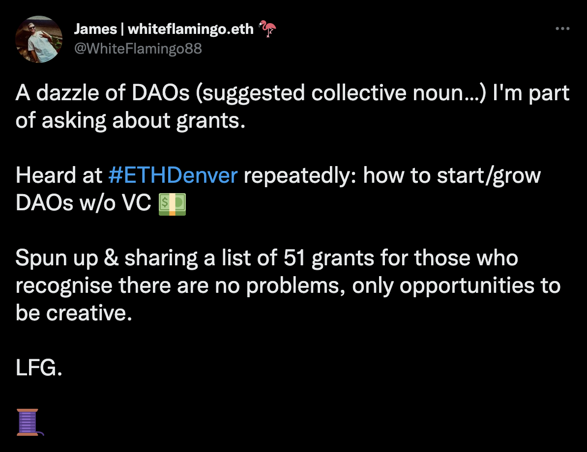

# What is Web3

## Overview of Web3 by phas3

## Further Reading

- [Web3 reading list for newcomers](https://ntkris.xyz/a-curated-reading-list-for-web3)
- [Everything you need to know about crypto in one essay](https://coinconfidential.com/everything-you-need-to-know-about-crypto/)
- [Kernel Community: Learn About a Better Web](https://www.kernel.community/en/learn/)

## More about Web3 Wallets
- [Rainbow Wallet set-up](https://learn.rainbow.me/)

## Web3 Grants

### The same, but in [Excel](https://docs.google.com/spreadsheets/d/1XHc-p_MHNRdjacc8uOEjtPoWL86olP4GyxAJOFO0zxY/edit#gid=0)

## Web3 themes

### Public goods
- [Gitcoin](https://gitcoin.co/)

### ReFi
- [What is ReFi?](https://je.mirror.xyz/S-dpms92hw6aiacUHoL3f_iAnLVDvbEUOXw7wpy7JaU)

### DeSci
- [A Guide to DeSci](https://future.a16z.com/what-is-decentralized-science-aka-desci/)
- [A Guide to Decentralized Biotech](https://future.a16z.com/a-guide-to-decentralized-biotech/)

### Data, AI & Distributed Compute
- [On Unlocking the Value of Data](https://blog.oceanprotocol.com/on-unlocking-the-value-of-data-a8dddb8efc02)
- [IPFS Powers the Distributed Web](https://ipfs.io/)
- [Filecoin](https://filecoin.io/)

### Web3 Learning Communities
- [Kernel](https://www.kernel.community/)
- [Encode](https://www.encode.club/)
- [ETHGlobal](https://ethglobal.com/)

## Get in touch

### Twitter: @phas3labs

### Website: phas3.io